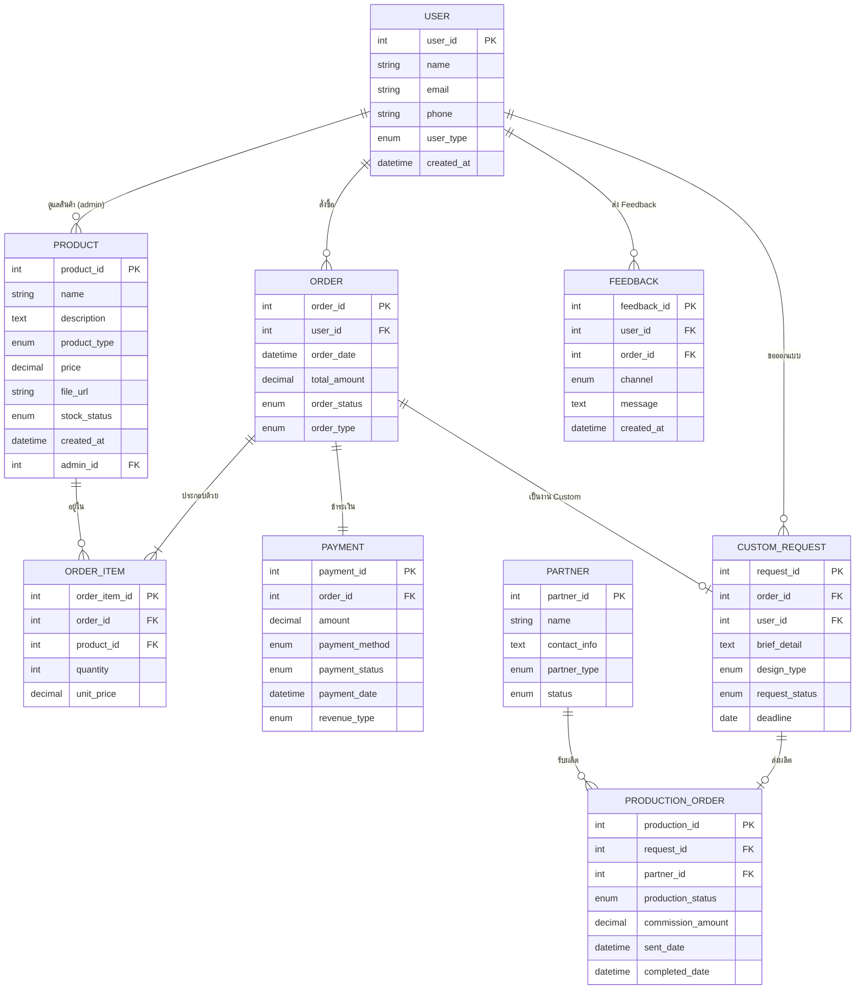

# ER Diagram: Digi9Craft

วิเคราะห์จาก Business Model Canvas และ Use Case Diagram เพื่อออกแบบ Entity-Relationship Diagram สำหรับระบบ Digi9Craft

---

## 1. Entities และ Attributes

### 👤 User (ผู้ใช้งาน)
| Attribute | Type | Description |
|---|---|---|
| **user_id** (PK) | INT | รหัสผู้ใช้งาน |
| name | VARCHAR(100) | ชื่อผู้ใช้งาน |
| email | VARCHAR(150) | อีเมล (unique) |
| phone | VARCHAR(20) | เบอร์โทรศัพท์ |
| user_type | ENUM | `customer`, `admin` |
| created_at | DATETIME | วันที่สมัคร |

### 🛒 Product (สินค้า/บริการ)
| Attribute | Type | Description |
|---|---|---|
| **product_id** (PK) | INT | รหัสสินค้า |
| name | VARCHAR(200) | ชื่อสินค้า |
| description | TEXT | รายละเอียดสินค้า |
| product_type | ENUM | `ebook`, `template`, `custom`, `souvenir` |
| price | DECIMAL(10,2) | ราคา |
| file_url | VARCHAR(500) | URL ไฟล์ดิจิทัล (สำหรับ ebook/template) |
| stock_status | ENUM | `available`, `out_of_stock` |
| created_at | DATETIME | วันที่เพิ่มสินค้า |
| admin_id (FK) | INT | ผู้ดูแลสินค้า → User |

### 📦 Order (คำสั่งซื้อ)
| Attribute | Type | Description |
|---|---|---|
| **order_id** (PK) | INT | รหัสคำสั่งซื้อ |
| user_id (FK) | INT | ลูกค้าที่สั่งซื้อ → User |
| order_date | DATETIME | วันที่สั่งซื้อ |
| total_amount | DECIMAL(10,2) | ยอดรวม |
| order_status | ENUM | `pending`, `confirmed`, `processing`, `completed`, `cancelled` |
| order_type | ENUM | `digital_purchase`, `custom_order` |

### 📋 Order_Item (รายการในคำสั่งซื้อ)
| Attribute | Type | Description |
|---|---|---|
| **order_item_id** (PK) | INT | รหัสรายการ |
| order_id (FK) | INT | คำสั่งซื้อ → Order |
| product_id (FK) | INT | สินค้า → Product |
| quantity | INT | จำนวน |
| unit_price | DECIMAL(10,2) | ราคาต่อหน่วย |

### 💳 Payment (การชำระเงิน)
| Attribute | Type | Description |
|---|---|---|
| **payment_id** (PK) | INT | รหัสการชำระเงิน |
| order_id (FK) | INT | คำสั่งซื้อ → Order |
| amount | DECIMAL(10,2) | จำนวนเงิน |
| payment_method | ENUM | `credit_card`, `promptpay`, `bank_transfer` |
| payment_status | ENUM | `pending`, `success`, `failed` |
| payment_date | DATETIME | วันที่ชำระเงิน |
| revenue_type | ENUM | `one_time`, `service_fee`, `commission`, `subscription` |

### 🎨 Custom_Request (คำของาน Custom)
| Attribute | Type | Description |
|---|---|---|
| **request_id** (PK) | INT | รหัสคำขอ |
| order_id (FK) | INT | คำสั่งซื้อ → Order |
| user_id (FK) | INT | ลูกค้าที่ขอ → User |
| brief_detail | TEXT | รายละเอียดบรีฟงาน |
| design_type | ENUM | `shirt_design`, `souvenir`, `template`, `other` |
| request_status | ENUM | `received`, `designing`, `review`, `approved`, `sent_to_partner` |
| deadline | DATE | กำหนดส่งงาน |

### 🤝 Partner (พาร์ทเนอร์)
| Attribute | Type | Description |
|---|---|---|
| **partner_id** (PK) | INT | รหัสพาร์ทเนอร์ |
| name | VARCHAR(150) | ชื่อร้าน/พาร์ทเนอร์ |
| contact_info | TEXT | ข้อมูลการติดต่อ |
| partner_type | ENUM | `screen_shop`, `souvenir_shop`, `designer`, `cms` |
| status | ENUM | `active`, `inactive` |

### 🏭 Production_Order (ออเดอร์การผลิต)
| Attribute | Type | Description |
|---|---|---|
| **production_id** (PK) | INT | รหัสการผลิต |
| request_id (FK) | INT | คำของาน Custom → Custom_Request |
| partner_id (FK) | INT | พาร์ทเนอร์ที่รับผลิต → Partner |
| production_status | ENUM | `sent`, `in_production`, `completed`, `delivered` |
| commission_amount | DECIMAL(10,2) | ค่า Commission ที่ได้รับ |
| sent_date | DATETIME | วันที่ส่งออเดอร์ |
| completed_date | DATETIME | วันที่ผลิตเสร็จ |

### 💬 Feedback (ข้อเสนอแนะ/ติดต่อ)
| Attribute | Type | Description |
|---|---|---|
| **feedback_id** (PK) | INT | รหัส Feedback |
| user_id (FK) | INT | ผู้ส่ง Feedback → User |
| order_id (FK) | INT | คำสั่งซื้อที่เกี่ยวข้อง → Order (nullable) |
| channel | ENUM | `line_oa`, `email`, `social_media`, `website` |
| message | TEXT | ข้อความ |
| created_at | DATETIME | วันที่ส่ง |

---

## 2. ความสัมพันธ์ระหว่าง Entities (Relationships)

| Entities | Cardinality | คำอธิบาย |
|---|---|---|
| User → Order | 1:N | ลูกค้า 1 คนมีได้หลายคำสั่งซื้อ |
| Order → Order_Item | 1:N | คำสั่งซื้อ 1 รายการมีได้หลายสินค้า |
| Product → Order_Item | 1:N | สินค้า 1 ชิ้นอยู่ในได้หลายคำสั่งซื้อ |
| Order → Payment | 1:1 | คำสั่งซื้อ 1 รายการมีการชำระเงิน 1 ครั้ง |
| Order → Custom_Request | 1:1 | คำสั่งซื้อประเภท Custom มีคำขอ 1 ใบ |
| User → Custom_Request | 1:N | ลูกค้า 1 คนมีได้หลายคำขอ Custom |
| Custom_Request → Production_Order | 1:1 | คำขอ 1 ใบส่งผลิตได้ 1 ออเดอร์ |
| Partner → Production_Order | 1:N | พาร์ทเนอร์ 1 ร้านรับได้หลายออเดอร์ผลิต |
| User → Feedback | 1:N | ผู้ใช้ 1 คนส่ง Feedback ได้หลายครั้ง |
| User → Product | M:N | Admin จัดการสินค้าหลายชิ้น (ผ่าน admin_id) |

---

## 3. ER Diagram (Mermaid Notation)

