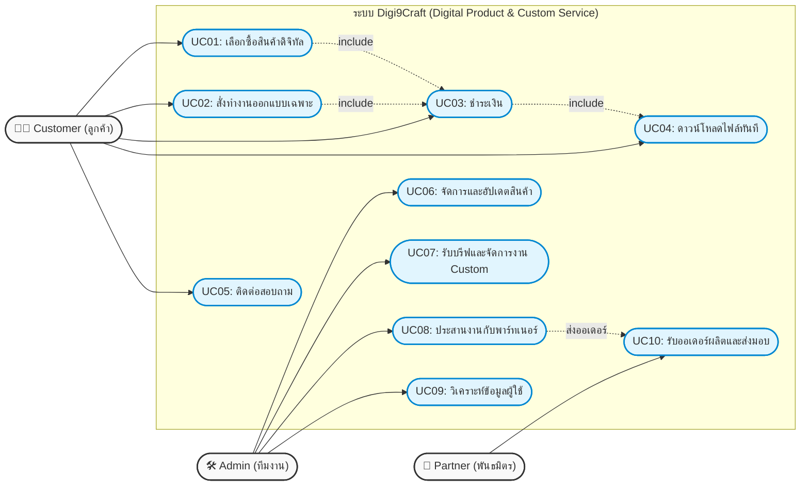

# Use Case Diagram: Digi9Craft

วิเคราะห์จาก Business Model Canvas เพื่อแปลงเป็น Use Case Diagram สำหรับระบบ Digi9Craft

## 1. ผู้ใช้งานระบบ (Actors)
1. **Customer (ลูกค้า):** สถานศึกษา, ลูกค้าที่ต้องการเสื้อตามเทศกาล, ลูกค้างาน Custom, ลูกค้า E-book, ลูกค้าองค์กร
2. **Admin/Team (ทีมงาน Digi9Craft):** ทีมงานที่ดูแลระบบ, อัปเดตสินค้า, ทำการตลาด, และประสานงาน
3. **Partner (พาร์ทเนอร์/พันธมิตร):** ร้านรับสกรีน, ร้านทำของที่ระลึก, นักออกแบบ

## 2. ยูสเคสหลัก (Key Use Cases)

### ส่วนของ Customer (ลูกค้า)
* **UC01: เลือกซื้อสินค้าดิจิทัล** (Browse & Buy Digital Products เช่น E-book, เทมเพลต)
* **UC02: สั่งทำงานออกแบบเฉพาะ** (Order Custom Design สำหรับลายเสื้อ หรือของที่ระลึก)
* **UC03: ชำระเงิน** (Payment - รองรับการซื้อขาด และการจ่ายค่าบริการ)
* **UC04: ดาวน์โหลดไฟล์ทันที** (Instant Download สำหรับสินค้าดิจิทัลหลังชำระเงิน)
* **UC05: ติดต่อสอบถาม/ให้ข้อเสนอแนะ** (Contact & Feedback ผ่าน Line OA, Email)

### ส่วนของ Admin/Team (ทีมงาน)
* **UC06: จัดการและอัปเดตสินค้าดิจิทัล** (Manage & Update Digital Products)
* **UC07: รับบรีฟและจัดการงาน Custom** (Manage Custom Orders)
* **UC08: ประสานงานกับพาร์ทเนอร์** (Coordinate with Partners สำหรับงานผลิต)
* **UC09: วิเคราะห์ข้อมูลผู้ใช้** (Analyze User Data สำหรับปรับปรุงบริการ)

### ส่วนของ Partner (พันธมิตร)
* **UC10: รับออเดอร์ผลิต** (Receive Production Orders)
* **UC11: แจ้งสถานะการผลิต/ส่งมอบ** (Update Production Status)

## 3. แผนภาพ Use Case (Mermaid Diagram)

